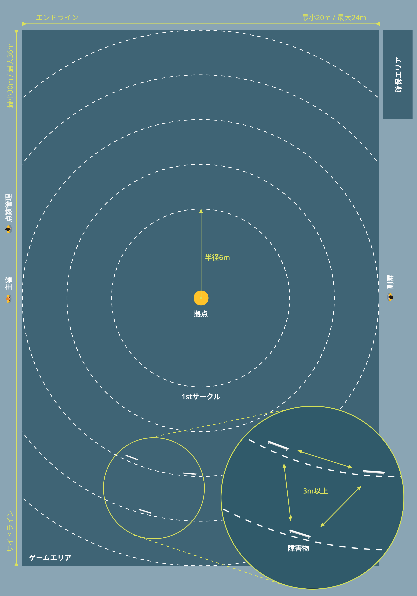

## 用語
### フィールド
- かくれんぼを開催するにあたり最低限必要なエリアが設置された場所を指す。
- 最低限必要となるエリアは「ゲームエリア」「確保エリア」となる。

### ゲームエリア
- かくれんぼを実施するためのエリア。拠点、障害物などを配置する。

### 確保エリア
- 鬼によって確保された子が待機するエリア。ゲームエリアより外に設置する。

### 拠点
- 鬼が守らなければならない物。かくれんぼにおいてこの拠点を中心にゲームが行われる。

### 1stサークル
- 拠点から半径6m圏内のことを指す。1stサークル内には障害物を設置することはできない。

### エンドライン
フィールドの短い2辺をエンドラインと定める。

### サイドライン
フィールドの長い2辺をサイドラインと定める。

## ゲームエリア
- かくれんぼを実施するに当たり、ゲームエリアを準備するための最低限の条件を記載する。

### 広さ

- かくれんぼを十分に楽しむための広さは横幅36m、縦幅20mとなる。（おおよそバスケットボールコート2面分）

### 表面
ゲームエリアは、安全性を考慮し屋外の場合は芝生を推奨する。
また、体育館、アリーナ等を利用した屋内での開催も可能である。

### 拠点
#### 基本
- 拠点として置く物の大きさは直径1m、高さ1m程度を推奨する。（現在公式は直径1mのビーチボールを使用）
- これよりも小さい場合、参加者同士での接触事故を引き起こすリスクが高まると考える。
- 一方で、これよりも大きい場合、鬼の視界を塞いでしまうリスクが高まると考える。

#### 配置
- フィールドの中心に拠点を設置するものとする。

### 障害物
#### 基本
- 大人が屈んで隠れられる障害物の参考として90cm四方のベニヤ板がある。
- これ以上のサイズのものであれば障害物としては有効と考える。
- また、仮にこれ以下のサイズでも拠点を攻めるに当たっての子側の障害物にもなり得るので有効性は多少あると考える。

#### 設置数
- 障害物の数は1フィールドあたり30-33個が適正となる。

#### 配置
- フィールドの中心から半径6m以内には障害物を設置しないものとする。
- また、障害物同士の間隔は最低でも3mはあけるものとする。（2枚連続の板などは除く）

- 障害物のバリエーションが多い場合は、拠点に近い位置に見つかりやすい障害物を、遠くに見つかりにくい障害物を配置するとよい。
