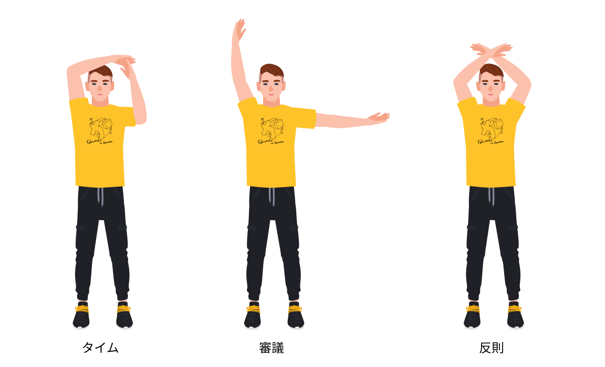

## 審判の心得
### 中立性の確立
- 審判はかくれんぼにおいて中立的な立場を保証する。
- すべての判定に対して中立的に判断し決定を下す。
- 恣意的な判定はゲームの進行、楽しさ、満足度を阻害するため行ってはならない。

### 安全性の確保
- 審判はかくれんぼにおいて安全な試合進行を保証する。
- 怪我や事故を起こしてまで点数を獲得する行為ができるだけ行われないよう判定にて安全性をコントロールする。
- ルールの施行よりも安全性の確保を優先とする。

### ルールの施行
- 審判はかくれんぼにおいて定められたルールの施行を保証する。
- 如何なる場合も独自の判断を行うことなく、ルールに従い判定を行う。
- ルールに記載されていない事象が発生した場合は、協議の上判定を行う。

### 改善への貢献
- 審判はかくれんぼの改善に対して積極的に関わることを保証する。
- ルールを試行する中で発生した不具合や、ルールでは判断しきれなかった事象をフィードバックする。
- その他、審判をしていて抱いた疑問や不明点なども合わせてフィードバックする。

## 審判の種類
### 主審
- 試合中の判定について最終責任を持つ。
- 判定内容に応じてマイクを使用して場に宣言する。
- 宣言の種類に応じてブザーでの対応も行う。

### 副審
- 主審がプレイを見落とした際の補助として状況を伝える役割を持つ。
- 反則の判定についての責任を持つ。
- 主審の判定が明らかに間違っている場合には審議を行う権利を持つ。

### 点数管理
- 専用のアプリにて得点の管理を行う。
- タイムキーパーとして時間の伝達を行う。
- あくまで審判の宣言に従い操作を行う。判定に対しての権限は持たない。

## 審判の人数
- 審判は1ゲームに対して主審1名、副審1名、点数管理1名をつける必要がある。

## 審判の宣言の種類と仕方
### 開始
1. 主審は所定の方法で鬼決めを行う。
1. 主審は鬼が決定した際に「鬼は〇〇（色、番号、名前）です」と宣言する。
1. 点数管理は主審の鬼決めの宣言を受け、アプリにて鬼を選択する。
1. 主審は参加者を拠点の周りに集め「スタート」と宣言し、ブザーを3秒間鳴らす。
1. 点数管理は主審の開始の宣言を受け、アプリにてゲームを開始する。

### 逃走タイム
1. 点数管理はアプリの時間を確認し10秒前の段階からカウントダウンを行う。
1. 逃走タイムのカウントダウンは点数管理が行うため、主審は行わない。
1. 主審は点数管理のカウントダウンが終了後「探索タイムスタート」と宣言し、ブザーを3秒間鳴らす。

### 確保
1. 主審は鬼が子を捕まえた際に「〇〇（捕まった人）アウト」と宣言する。
1. 複数人同時に確保された場合は「赤、青、緑アウト」というように宣言する。
1. 点数管理はアプリの「確保」ボタンをクリックして該当の参加者を確保状態にする。

### 開放
1. 主審は子が拠点をタッチした際にブザーを3秒間鳴らし、「〇〇（タッチした人）リリース」と宣言する。
1. 点数管理はアプリの「開放」ボタンをクリックして参加者全員を開放する。（アプリ側で自動的にタイマーが停止する）
1. 主審は10秒数える旨を宣言し、カウントダウンを行う。ゲーム再開した際にはブザーを1秒鳴らす。
1. 点数管理は主審の再開の合図とともにタイマーを再開する。

### タイム
1. 主審は判定が困難な場合やゲームを一時停止する必要がある場合に「タイム」と宣言し、ブザーを3秒間鳴らす。
1. 点数管理はアプリのタイマー停止ボタンをクリックしてタイマーを停止する。
1. 必要に応じて副審との協議を行う。
1. 子が隠れる必要がある場合は、10秒数える旨を宣言し、カウントダウンを行う。
1. 子が隠れる必要がない場合は、再開を宣言する。
1. 主審はゲーム再開した際にはブザーを1秒鳴らす。
1. 点数管理は主審の再開の合図とともにタイマーを再開する。

### 無効
1. 主審は鬼が捕まえる際や子が拠点をタッチする際に、状況的に明らかに鬼または子が不利な状態となる場合は「〇〇の確保（もしくは開放）は無効」と宣言する。
1. 点数管理は無効が判定されたタイミングで間違って操作してしまった場合、該当の操作履歴を削除する。

### 審議申立（副審）
1. 副審は審議のハンドサインで主審に合図を送る。
1. 主審は副審の審議の合図を受け取り、「審議」の宣言とともにブザーを3秒間鳴らす。
1. 点数管理はアプリのタイマー停止ボタンをクリックしてタイマーを停止する。
1. 主審と副審で異議の内容をすり合わせ、必要に応じて判定の変更を行う。
1. 点数管理は異議の内容に基づいてアプリを操作する。
1. 子が隠れる必要がある場合は、10秒数える旨を宣言し、カウントダウンを行う。
1. 子が隠れる必要がない場合は、再開を宣言する。
1. 主審はゲーム再開した際にはブザーを1秒鳴らす。
1. 点数管理は主審の再開の合図とともにタイマーを再開する。

### 反則（副審）
1. 副審は反則のハンドサインで主審に合図を送る。
1. 主審は副審の反則の合図を受け取り、「反則」の宣言とともにブザーを3秒間鳴らす。
1. 点数管理はアプリのタイマー停止ボタンをクリックしてタイマーを停止する。
1. 主審は副審から反則の内容を確認し、反則が該当する参加者に声を掛ける。
1. 主審は該当の参加者に反則の内容を伝える。
1. 主審は反則の内容を宣言する。
1. 点数管理はアプリより反則の内容を反映させる。
1. 子が隠れる必要がある場合は、10秒数える旨を宣言し、カウントダウンを行う。
1. 子が隠れる必要がない場合は、再開を宣言する。
1. 主審はゲーム再開した際にはブザーを1秒鳴らす。
1. 点数管理は主審の再開の合図とともにタイマーを再開する。

### 終了
1. 主審は終了の旨を宣言し、ブザーを1秒、1秒、3秒という形で複数回鳴らす。
1. 点数管理はアプリでゲーム終了の操作を行う。

### 時間管理
1. 点数管理は残り時間が3分、1分、30秒の時に「残り時間〇〇分（秒）です！」というように宣言する。
1. 点数管理は残り10秒のタイミングからカウントダウンを開始する。

## 審判の立ち位置
- 拠点を中心として対になる形で主審、副審が立つ。
- 点数管理はすぐさま判定の確認ができるよう主審の近くに立つ。
- 具体的なイメージについてはフィールドガイドラインに記載している。

## ハンドサイン

